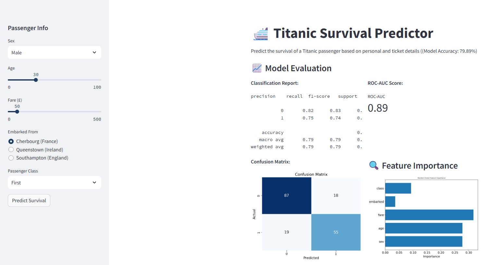

# 🛳️ Titanic Survival Predictor

A Streamlit web application that predicts the survival of Titanic passengers based on demographic and ticket-related inputs. Built using a Random Forest classifier trained on the Titanic dataset from Seaborn.

---

## 🚀 Features

- Input fields to simulate passenger attributes (sex, age, fare, etc.)
- Predicts whether a passenger would have survived
- Displays model performance:
  - Classification report
  - ROC-AUC score
  - Confusion matrix
  - Feature importance
- Interactive sidebar for real-time predictions

---

## 📊 Sample Output



---

## 🛠️ Technologies Used

- **Python 3.10+**
- **Streamlit**
- **Pandas**
- **Seaborn**
- **Matplotlib**
- **Scikit-learn**

---

## 📦 Installation

```bash
git clone https://github.com/yourusername/titanic-predictor-app.git
cd titanic-predictor-app
pip install -r requirements.txt
